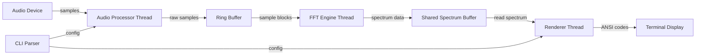

# Design Document

## Overview

The Terminal Music Visualizer is a real-time audio visualization application built in Rust. The system follows a multi-threaded architecture where audio capture and FFT processing run on separate threads from the terminal rendering loop. This design ensures smooth visual output while maintaining low-latency audio processing.

The application uses a pipeline architecture: Audio Input → Sample Buffer → FFT Processing → Spectrum Smoothing → Visualization Rendering. Each stage is decoupled through thread-safe buffers, allowing independent optimization of each component.

## Architecture

### High-Level Architecture



### Threading Model

The application uses three primary threads:

1. **Audio Capture Thread**: Runs the cpal audio input stream callback, writes samples to ring buffer
2. **FFT Processing Thread**: Reads sample blocks from ring buffer, performs FFT, writes spectrum data to shared buffer
3. **Main/Render Thread**: Reads spectrum data, applies smoothing, renders to terminal at fixed frame rate

Thread synchronization uses lock-free ring buffers for audio samples and a mutex-protected buffer for spectrum data (updated 30-60 times per second, so contention is minimal).

### Data Flow

```
Audio Device (44.1kHz)
    ↓
Ring Buffer (8192 samples capacity)
    ↓
FFT Engine (2048 sample blocks with 50% overlap)
    ↓
Frequency Bins (1024 complex values)
    ↓
Magnitude Conversion (1024 real values in dB)
    ↓
Logarithmic Binning (32-64 visual bars)
    ↓
Smoothing Buffer (exponential moving average)
    ↓
Visualizer Mode Renderer
    ↓
Terminal Display (30-60 FPS)
```

## Components and Interfaces

### 1. Audio Processor

**Responsibility**: Capture audio from system devices and buffer samples

**Key Types**:
```rust
pub struct AudioProcessor {
    device: cpal::Device,
    config: cpal::StreamConfig,
    stream: Option<cpal::Stream>,
    sample_buffer: Arc<RingBuffer<f32>>,
}

impl AudioProcessor {
    pub fn new(device_name: Option<&str>) -> Result<Self>;
    pub fn start(&mut self) -> Result<()>;
    pub fn stop(&mut self);
    pub fn list_devices() -> Vec<String>;
}
```

**Design Decisions**:
- Uses `cpal` crate for cross-platform audio I/O (supports Windows, macOS, Linux)
- Ring buffer sized at 8192 samples (185ms at 44.1kHz) to handle processing delays
- Audio callback writes directly to lock-free ring buffer to minimize latency
- Supports both input devices (microphone) and loopback devices (system audio)

### 2. FFT Engine

**Responsibility**: Transform time-domain audio samples into frequency-domain spectrum

**Key Types**:
```rust
pub struct FftEngine {
    fft_size: usize,
    planner: FftPlanner<f32>,
    window: Vec<f32>,
    input_buffer: Vec<Complex<f32>>,
    output_buffer: Vec<Complex<f32>>,
    sample_source: Arc<RingBuffer<f32>>,
}

impl FftEngine {
    pub fn new(fft_size: usize, sample_source: Arc<RingBuffer<f32>>) -> Self;
    pub fn process_block(&mut self) -> Option<Vec<f32>>;
    fn apply_window(&mut self, samples: &[f32]);
    fn compute_magnitudes(&self) -> Vec<f32>;
}
```

**Design Decisions**:
- FFT size of 2048 provides good frequency resolution (21.5 Hz bins at 44.1kHz)
- Hann window function reduces spectral leakage: `w(n) = 0.5 * (1 - cos(2πn/N))`
- 50% overlap between blocks for smoother temporal resolution
- Magnitude conversion: `20 * log10(|complex|)` for decibel scale
- Only processes positive frequencies (bins 0 to N/2) since input is real

### 3. Frequency Binner

**Responsibility**: Map FFT bins to logarithmic frequency bands for musical visualization

**Key Types**:
```rust
pub struct FrequencyBinner {
    bands: Vec<FrequencyBand>,
    fft_size: usize,
    sample_rate: f32,
}

struct FrequencyBand {
    start_bin: usize,
    end_bin: usize,
    center_freq: f32,
}

impl FrequencyBinner {
    pub fn new(num_bands: usize, fft_size: usize, sample_rate: f32) -> Self;
    pub fn bin_spectrum(&self, fft_magnitudes: &[f32]) -> Vec<f32>;
}
```

**Design Decisions**:
- Uses logarithmic frequency scale to match human hearing perception
- Frequency bands calculated using: `f(i) = f_min * (f_max/f_min)^(i/N)`
- Default range: 20 Hz to 20 kHz (human hearing range)
- Number of bands adapts to terminal width (typically 32-64 bands)
- Each band averages multiple FFT bins for noise reduction

### 4. Spectrum Smoother

**Responsibility**: Apply temporal smoothing to reduce visual jitter

**Key Types**:
```rust
pub struct SpectrumSmoother {
    smoothed_values: Vec<f32>,
    peak_values: Vec<f32>,
    peak_decay_rate: f32,
    smoothing_factor: f32,
}

impl SpectrumSmoother {
    pub fn new(num_bands: usize, smoothing_factor: f32) -> Self;
    pub fn smooth(&mut self, new_values: &[f32]) -> &[f32];
    fn update_peaks(&mut self, values: &[f32]);
}
```

**Design Decisions**:
- Exponential moving average: `smoothed = α * new + (1-α) * old` where α = 0.7
- Peak hold with decay: peaks decay at 0.95 per frame (5% reduction)
- Separate peak tracking allows "peak dots" visualization effect
- Smoothing applied after frequency binning to reduce computation

### 5. Terminal Renderer

**Responsibility**: Manage terminal state and coordinate visualization rendering

**Key Types**:
```rust
pub struct TerminalRenderer {
    terminal: Terminal<CrosstermBackend<Stdout>>,
    mode: Box<dyn VisualizerMode>,
    config: RenderConfig,
}

pub struct RenderConfig {
    pub sensitivity: f32,
    pub color_scheme: ColorScheme,
    pub show_peaks: bool,
}

impl TerminalRenderer {
    pub fn new(mode: Box<dyn VisualizerMode>, config: RenderConfig) -> Result<Self>;
    pub fn render_frame(&mut self, spectrum: &[f32]) -> Result<()>;
    pub fn cleanup(&mut self) -> Result<()>;
}
```

**Design Decisions**:
- Uses `crossterm` for cross-platform terminal control
- Enters raw mode to disable line buffering and cursor
- Double buffering via crossterm's internal buffer
- Automatic terminal size detection and resize handling
- Cleanup ensures terminal restoration even on panic (via Drop trait)

### 6. Visualizer Modes

**Responsibility**: Render spectrum data in different visual styles

**Key Types**:
```rust
pub trait VisualizerMode: Send {
    fn render(&self, spectrum: &[f32], canvas: &mut Canvas, config: &RenderConfig);
    fn name(&self) -> &str;
}

pub struct SpectrumBarsMode;
pub struct WaveformMode {
    history: VecDeque<f32>,
}
pub struct CircularMode;
```

**Mode Implementations**:

#### Spectrum Bars Mode
- Vertical bars using Unicode block characters: `▁▂▃▄▅▆▇█`
- Each bar represents one frequency band
- Height proportional to magnitude (scaled by sensitivity)
- Color gradient from red (bass) to blue (treble)
- Optional peak dots above bars

#### Waveform Mode
- Horizontal scrolling display of audio amplitude
- Maintains history buffer of recent amplitude values
- Uses line-drawing characters: `─│╭╮╯╰`
- Amplitude calculated as RMS of all frequency bands
- Scrolls right-to-left at fixed rate

#### Circular Mode
- Radial display with frequency bands as spokes
- Uses box-drawing characters for circular shapes
- Radius of each spoke proportional to magnitude
- Rotates color gradient around circle
- Center shows overall amplitude

### 7. Color Scheme

**Responsibility**: Map frequency bands to colors

**Key Types**:
```rust
pub struct ColorScheme {
    colors: Vec<Color>,
}

impl ColorScheme {
    pub fn gradient(colors: Vec<Color>) -> Self;
    pub fn get_color(&self, band_index: usize, num_bands: usize) -> Color;
}
```

**Design Decisions**:
- Linear interpolation between specified colors
- Default gradient: Red → Yellow → Green → Cyan → Blue
- Supports custom gradients via CLI (e.g., `--colors red,purple,blue`)
- Uses crossterm's Color enum for terminal compatibility

### 8. CLI Parser

**Responsibility**: Parse command-line arguments and create configuration

**Key Types**:
```rust
pub struct CliConfig {
    pub device_name: Option<String>,
    pub mode: String,
    pub sensitivity: f32,
    pub colors: Vec<String>,
    pub list_modes: bool,
}

impl CliConfig {
    pub fn parse() -> Self;
    pub fn validate(&self) -> Result<()>;
}
```

**Design Decisions**:
- Uses `clap` crate with derive macros for argument parsing
- Provides sensible defaults for all optional arguments
- Validates ranges (e.g., sensitivity 0.1-5.0)
- `--list-modes` and `--help` exit early without initializing audio

## Data Models

### Spectrum Data

```rust
pub struct SpectrumData {
    pub bands: Vec<f32>,        // Magnitude values in dB
    pub peaks: Vec<f32>,        // Peak hold values
    pub timestamp: Instant,     // When data was captured
}
```

Shared between FFT thread and render thread via `Arc<Mutex<SpectrumData>>`. Updated 30-60 times per second by FFT thread, read by render thread at frame rate.

### Audio Sample

Raw audio samples are `f32` values in range [-1.0, 1.0]. Stored in lock-free ring buffer as contiguous array for efficient FFT processing.

### Canvas

```rust
pub struct Canvas {
    width: usize,
    height: usize,
    buffer: Vec<Vec<Cell>>,
}

pub struct Cell {
    character: char,
    color: Color,
}
```

Internal representation for building frame before flushing to terminal. Allows visualizer modes to draw without direct terminal access.

## Error Handling

### Error Types

```rust
pub enum VisualizerError {
    AudioDeviceError(String),
    TerminalError(String),
    ConfigError(String),
    FftError(String),
}

impl std::error::Error for VisualizerError {}
impl std::fmt::Display for VisualizerError {}
```

### Error Handling Strategy

1. **Initialization Errors**: Return `Result` and display helpful error messages
   - Audio device not found → list available devices
   - Terminal not supported → show minimum requirements
   - Invalid config → show valid ranges/options

2. **Runtime Errors**: Log and continue when possible
   - Corrupted audio samples → skip frame
   - FFT computation error → use previous spectrum
   - Render error → attempt recovery, exit if persistent

3. **Cleanup**: Use RAII pattern (Drop trait) to ensure terminal restoration
   - Register panic hook to restore terminal
   - Handle Ctrl+C signal gracefully
   - Flush buffers before exit

### Logging

Use `log` crate with `env_logger` for debugging:
- ERROR: Critical failures that prevent operation
- WARN: Recoverable issues (dropped frames, buffer overruns)
- INFO: Startup information, configuration
- DEBUG: Performance metrics, buffer states
- TRACE: Per-frame processing details

## Testing Strategy

### Unit Tests

1. **FFT Engine Tests**
   - Test window function generation (Hann window properties)
   - Test magnitude conversion (known sine wave → expected peak)
   - Test frequency bin calculation

2. **Frequency Binner Tests**
   - Test logarithmic band calculation
   - Test bin averaging logic
   - Test edge cases (empty spectrum, single band)

3. **Spectrum Smoother Tests**
   - Test exponential moving average calculation
   - Test peak hold and decay behavior
   - Test initialization with different sizes

4. **Color Scheme Tests**
   - Test gradient interpolation
   - Test color mapping for different band counts
   - Test custom color parsing

### Integration Tests

1. **Audio Pipeline Test**
   - Generate synthetic audio signal (sine wave)
   - Feed through audio processor → FFT → binner
   - Verify expected frequency peak appears in correct band

2. **Render Pipeline Test**
   - Create mock spectrum data
   - Render each visualizer mode
   - Verify output dimensions and character usage

### Manual Testing

1. **Audio Sources**
   - Test with microphone input (speech, music)
   - Test with system audio (various applications)
   - Test with different audio devices

2. **Terminal Compatibility**
   - Test on Windows Terminal, PowerShell, CMD
   - Test on macOS Terminal, iTerm2
   - Test on Linux terminals (gnome-terminal, konsole, alacritty)

3. **Performance Testing**
   - Monitor CPU usage during operation
   - Test with different FFT sizes
   - Test with different frame rates
   - Profile with `cargo flamegraph`

### Test Data

Create test audio files for consistent testing:
- `sine_440hz.wav`: Pure 440 Hz tone (A4 note)
- `sweep_20_20k.wav`: Frequency sweep from 20 Hz to 20 kHz
- `white_noise.wav`: White noise for full spectrum test
- `music_sample.wav`: Short music clip with varied frequency content

## Performance Considerations

### Optimization Targets

- CPU usage: < 15% on modern quad-core processor
- Frame rate: Stable 60 FPS
- Audio latency: < 50ms from input to visualization
- Memory usage: < 50 MB

### Optimization Techniques

1. **Pre-allocation**: Allocate all buffers during initialization
2. **Lock-free audio path**: Ring buffer avoids mutex in audio callback
3. **SIMD**: FFT library uses SIMD instructions automatically
4. **Minimize allocations**: Reuse buffers, avoid Vec growth in hot path
5. **Efficient rendering**: Only update changed terminal cells (future optimization)

### Profiling Points

- Audio callback duration (must be < 10ms)
- FFT computation time
- Frequency binning time
- Render frame time
- Total frame time (target < 16ms for 60 FPS)

## Future Enhancements

### Phase 2 Features (Post-MVP)

1. **Beat Detection**: Detect beats using onset detection algorithms
2. **Audio File Playback**: Visualize audio files using `rodio` crate
3. **Configuration File**: Save/load settings from TOML file
4. **Recording**: Export visualization as animated GIF using `gif` crate
5. **Additional Modes**: Particle mode, spectrogram mode

### Technical Debt to Address

1. Consider using `ratatui` for more sophisticated terminal UI
2. Implement adaptive FFT size based on audio content
3. Add GPU acceleration for FFT (via `cuFFT` or `VkFFT`)
4. Optimize terminal rendering to only update changed regions
5. Add support for multi-channel audio (stereo visualization)
